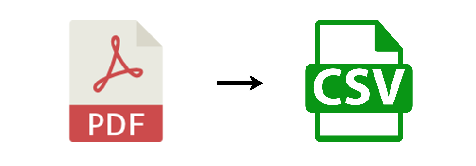

# INVOICE-EXTRACTOR




## INTRODUCTION
This project was created with the idea of helping company accounting teams quickly extract and export invoice information into a CSV file.


## PROJECT REQUIREMENTS
* The code must be reusable.
* It must be able to read PDF files.
* We should be able to specify the format of the information we want to extract.
* It must rename the files using relevant information from the document to allow quick identification.
* It must extract the information and create a CSV file with it.

## LANGUAGE
The source code is developed in TypeScript. However, you can modify it as you wish to work with the language you're most comfortable with.


## PREREQUISITES AND DEPENDENCIES
* Node.js >= 16
* npm >= 
* fs module
* TypeScript
* pdf-parse
* @types/node
  

## SET UP
Setting up a new project is quite simple with the invoice-extractor CLI. With npm installed, you can create a new invoice-extractor project with the following commands in your OS terminal:

>```bash
>npX nombre-proyecto-cli init
>

>[!IMPORTANT]
>Don't forget to install your project's dependencies.
>```bash
>npm install
>```


## GETTING STARTED

1. Create your project folder and navigate into it.

2. Run the following command:

   > `npx nombre-cli init`

3. Create as many scripts as needed based on the number of vendors you have.

4. Modify the object you’ll pass as an argument according to the invoice’s structure and how the information appears — keep in mind that `pdf-parse` returns the content line by line.

5. Adjust the regex for each value you need to extract.

6. Modify the JSON structure based on the vendor, or add new ones if necessary.

7. Run the script.

## DEMO
🔗 Check out the demo on my LinkedIn. [LinkedIn](https://www.linkedin.com/posts/tu_usuario/lo-que-sea).


### LINKS